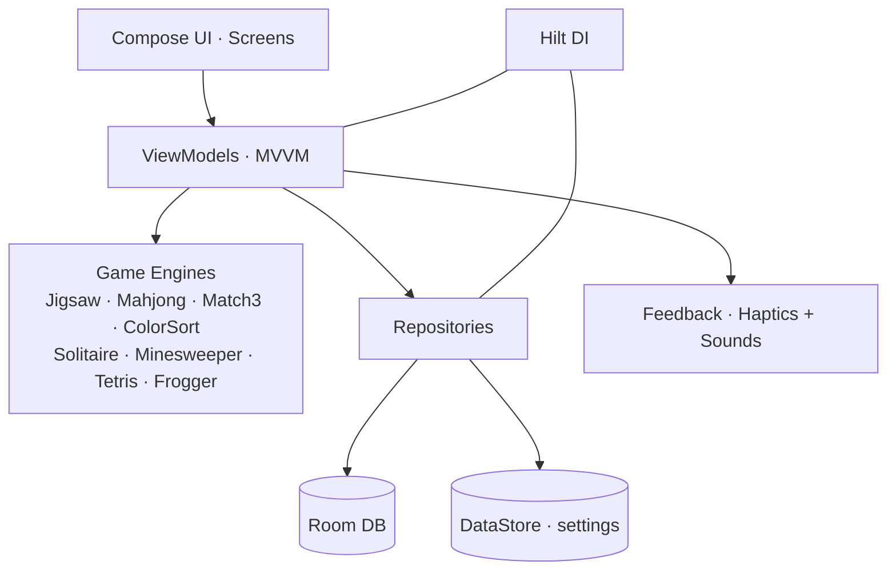

<div align="center">


# 🧩 Fatima Games

**Jogos casuais para Android — com calma, beleza e acessibilidade em primeiro lugar.**
*Calm, beautiful, accessibility-first casual games for Android.*

<br />

[](https://github.com/caioross/FatimaGames/releases/latest/download/FatimaGames.apk)
[](https://fatimagames.vercel.app)

[](https://github.com/caioross/FatimaGames/actions/workflows/build-apk.yml)
[](https://www.android.com)
[](https://kotlinlang.org)
[](https://developer.android.com/jetpack/compose)
[](https://dagger.dev/hilt/)
[](https://developer.android.com/training/data-storage/room)
[](#-princípios-não-negociáveis)
[](#)

🇧🇷 [**Português**](#-português) · 🇺🇸 [**English**](#-english)

</div>

---

## 🇧🇷 Português
<a name="-português"></a>

> ### 💚 *"Feito com amor, para a mamãe."*
> O Fatima Games nasceu de um desejo simples: dar à minha mãe — e a quem mais quiser —
> jogos bonitos e tranquilos, **sem as armadilhas dos apps gratuitos de sempre**. Nada de
> anúncios no meio da partida, nada de cobranças escondidas. Só momentos de descanso.

### O que é

**Fatima Games** é um aplicativo Android **nativo** de jogos casuais, escrito 100% em
**Kotlin + Jetpack Compose (Material 3)**. O foco não é viciar — é **relaxar**: visual coeso,
animações suaves a 60 fps, modo escuro, fontes escaláveis e **zero monetização agressiva**.

São **8 jogos**, e cada um traz o seu próprio motor escrito do zero — do *slicer* de
quebra-cabeça com curvas de Bézier ao gerador de fases sempre solucionáveis do Color Sort.

| | |
|---|---|
| **Plataforma** | Android (Kotlin · Jetpack Compose · Material 3) |
| **Min SDK** | 26 (Android 8.0) · **Target SDK** 34 (Android 14) |
| **Arquitetura** | MVVM + Hilt (DI) + Room + DataStore + Navigation Compose |
| **Versão** | 1.0.0 |
| **Jogos** | 8 (todos com motor próprio) |
| **Site** | **[fatimagames.vercel.app](https://fatimagames.vercel.app)** |
| **Distribuição** | [APK direto](https://github.com/caioross/FatimaGames/releases/latest) (CI a cada push) → Play Store (futuro) |
| **Como compilar** | [BUILD.md](BUILD.md) · [HOW_TO_GET_APK.md](HOW_TO_GET_APK.md) |

### 🎮 Os jogos

Oito clássicos, um só lugar tranquilo. Cada motor foi construído à mão para rodar a 60 fps no aparelho-alvo.

| Jogo | Gênero | Destaque técnico |
|---|---|---|
| 🧩 **Quebra-cabeça** | Suas fotos | *Slicer* com curvas de Bézier (encaixe clássico aba/fenda), *drag-and-drop* com *snap*, agrupamento *union-find*, de 12 a 100 peças |
| 🀄 **Mahjong** | Pares iguais | Layout tartaruga, `isFree()` correto, equivalência de Flores/Estações, Dica · Desfazer · Embaralhar, **auto-save** |
| 💎 **Combinar gemas** | Match-3 | Grade 8×8, *swap* validado, cascata com gravidade, **gemas especiais** (Flame H/V, Bomba) em matches 4+/5+ |
| 🧪 **Organizar cores** | Color Sort | **30 fases procedurais** geradas por *solver* reverso (sempre solucionáveis), Desfazer, tubo extra |
| 🃏 **Paciência** | Klondike | 7 colunas + 4 fundações por naipe, *stock/waste* de 1 carta, do Ás ao Rei, vitória com as 52 cartas |
| 💣 **Campo Minado** | Dedução | 3 dificuldades (9×9 · 12×10 · 16×12), bandeiras, contagem de adjacência, primeira jogada segura |
| 🟦 **Tetris** | Encaixe | Tabuleiro 20×10, 7 tetrominós com rotação, *clear* de linhas, paleta coesa |
| 🐸 **Sapo aventureiro** | Frogger | Grade 11×13, faixas de carro e rio, troncos, 3 vidas, 5 vagas de chegada |

### ✨ Recursos

**Polimento de experiência**
- Saudação dinâmica (Bom dia / tarde / noite) na Home + **Continue Banner** da partida salva
- Ilustrações vetoriais customizadas em cada card de jogo
- Tema **claro / escuro / automático** aplicado em runtime
- **Escala de fonte** global (Normal / Grande / Maior, até 1.30×)
- **Háptica integrada** com toggle (tick, snap, erro, vitória) + efeitos sonoros
- **Tela de vitória** com confete + medalha + cards de estatísticas
- Tutorial overlay na primeira partida, estado vazio reutilizável e diálogo de saída

**Persistência & estatísticas**
- **Room** (records, estado de jogo, fotos, settings) + **DataStore** (configs + flags de tutoriais vistos)
- **Stats** com mini gráfico de barras das últimas 10 partidas por jogo
- Auto-save nos jogos longos: saiu no meio? O jogo te espera onde parou

**♿ Acessibilidade — o ponto de partida, não um detalhe**
- Alvos de toque 56 dp+ (72 dp nos botões principais), espaçados ≥ 8 dp
- Textos ≥ 16 sp, escaláveis até 1.30×; modo escuro 100% funcional
- Contraste **AA mínimo** (AAA no texto principal), foco navegável e leitura por TalkBack
- Sem cor como único veículo de informação

### ⬇️ Baixar e jogar

O jeito mais rápido: baixe o APK mais recente, gerado automaticamente a cada atualização.

**[⬇️ Baixar Fatima Games (APK)](https://github.com/caioross/FatimaGames/releases/latest/download/FatimaGames.apk)**

1. Baixe o `FatimaGames.apk` no celular (ou transfira do computador).
2. Abra o arquivo e confirme a instalação — pode ser preciso autorizar **"Fontes desconhecidas"** uma única vez.
3. Pronto. Tudo funciona **offline**, sem login e sem coleta de dados.

> Passo a passo com imagens em **[HOW_TO_GET_APK.md](HOW_TO_GET_APK.md)**.

### 🌐 Site

A vitrine do projeto vive em **[fatimagames.vercel.app](https://fatimagames.vercel.app)** —
uma landing page bilíngue (PT/EN), acolhedora e acessível, feita em **Next.js 14 + Tailwind CSS**,
com SEO completo (Open Graph, sitemap, dados estruturados JSON-LD) e suporte a
`prefers-reduced-motion`. O código fica em [`site/`](site) (repositório próprio).

```bash
cd site
npm install
npm run dev      # http://localhost:3000
```

### 🛠️ Como compilar e rodar o app

```bash
# Via Android Studio: File → Open → esta pasta → Run (▶)

# Via terminal (precisa de JDK 17 + Android SDK):
./gradlew assembleDebug
# APK gerado em: app/build/outputs/apk/debug/app-debug.apk
```

> Guia completo passo a passo em **[BUILD.md](BUILD.md)**.

### 🏛️ Arquitetura



Princípio: **lógica de jogo isolada do Compose**. Cada motor é puro Kotlin, testável em JVM,
sem dependência de Android — a UI apenas observa o estado e dispara intents.

### 📁 Estrutura

```
FatimaGames/
├── README.md · BUILD.md · HOW_TO_GET_APK.md
├── settings.gradle.kts · build.gradle.kts · gradle.properties
├── gradle/ (libs.versions.toml, wrapper) · gradlew · gradlew.bat
├── .github/workflows/build-apk.yml        # CI: builda e publica o APK "latest"
├── docs/                                   # PRD, design system, arquitetura, specs, roadmap
├── site/                                   # landing page (Next.js + Tailwind, repo próprio)
└── app/src/main/
    ├── AndroidManifest.xml
    ├── java/com/fatimagames/app/
    │   ├── core/      # di · feedback (haptics/sounds) · navigation · theme · ui
    │   ├── data/      # db (Room) · repository · settings (DataStore)
    │   ├── domain/    # model · repository
    │   └── feature/
    │       ├── home · splash · settings · stats · photolibrary
    │       └── games/  # jigsaw · mahjong · match3 · colorsort
    │                   # solitaire · minesweeper · tetris · frogger
    └── res/           # strings, colors, themes, drawables, ícones
```

### 📚 Documentação

- [PRD](docs/01-product/PRD.md) · [Personas](docs/01-product/personas.md)
- [Design System](docs/02-design/design-system.md) · [UX & a11y](docs/02-design/ux-principles.md)
- [Arquitetura](docs/03-architecture/architecture.md)
- Specs dos jogos: [Jigsaw](docs/04-games/jigsaw.md) · [Mahjong](docs/04-games/mahjong.md) · [Match-3](docs/04-games/match3.md) · [Color Sort](docs/04-games/color-sort.md)
- [Padrões + ADRs](docs/05-engineering/standards.md) · [Roadmap](docs/06-roadmap.md)

### 🧭 Princípios não-negociáveis
<a name="-princípios-não-negociáveis"></a>

1. **Zero monetização agressiva** — sem anúncios, sem IAP, sem energia que acaba
2. **Acessibilidade-first** — alvos generosos, contraste alto, fontes legíveis
3. **Trabalho nunca se perde** — auto-save em jogos longos
4. **Visual coeso** — uma paleta, um sistema de motion
5. **Performance > efeito** — 60 fps no device-alvo é regra
6. **Privacidade total** — tudo roda offline; suas fotos e dados ficam no aparelho

---

## 🇺🇸 English
<a name="-english"></a>

> ### 💚 *"Made with love, for mom."*
> Fatima Games started from a simple wish: to give my mother — and anyone else who'd like
> them — beautiful, peaceful games **without the traps of the usual free apps**. No ads
> mid-game, no hidden charges. Just moments of rest.

### What it is

**Fatima Games** is a **native** Android casual-games app, written entirely in
**Kotlin + Jetpack Compose (Material 3)**. The goal isn't to hook you — it's to **relax**:
a cohesive look, smooth 60 fps animations, dark mode, scalable fonts and **zero aggressive
monetization**. It ships **8 games**, each with its own hand-written engine.

| | |
|---|---|
| **Platform** | Android (Kotlin · Jetpack Compose · Material 3) |
| **Min SDK** | 26 (Android 8.0) · **Target SDK** 34 (Android 14) |
| **Architecture** | MVVM + Hilt + Room + DataStore + Navigation Compose |
| **Version** | 1.0.0 · **8 games** |
| **Website** | **[fatimagames.vercel.app](https://fatimagames.vercel.app)** |
| **How to build** | [BUILD.md](BUILD.md) · [HOW_TO_GET_APK.md](HOW_TO_GET_APK.md) |

### 🎮 The games

| Game | Genre | Technical highlight |
|---|---|---|
| 🧩 **Jigsaw** | Your photos | Cubic-Bézier slicer (classic tab/slot), drag-and-drop snap, union-find grouping, 12–100 pieces |
| 🀄 **Mahjong** | Solitaire | Turtle layout, correct `isFree()`, Flowers/Seasons equivalence, hint/undo/shuffle, **auto-save** |
| 💎 **Match Gems** | Match-3 | 8×8 grid, validated swap, gravity cascade, **special gems** (Flame H/V, Bomb) on 4+/5+ matches |
| 🧪 **Color Sort** | Sort colors | **30 procedural levels** built by a reverse solver (always solvable), undo, extra tube |
| 🃏 **Solitaire** | Klondike | 7 tableau columns + 4 suit foundations, single-draw stock/waste, Ace→King, win with all 52 |
| 💣 **Minesweeper** | Deduction | 3 difficulties (9×9 · 12×10 · 16×12), flags, adjacency counts, safe first move |
| 🟦 **Tetris** | Stacking | 20×10 board, 7 rotating tetrominoes, line clears, cohesive palette |
| 🐸 **Frog Crossing** | Frogger | 11×13 grid, car & river lanes, logs, 3 lives, 5 goal slots |

### Features

- **Polish** — dynamic greeting + continue banner, custom vector art per game, light/dark/auto
  theme at runtime, global font scaling, integrated haptics + sound, victory screen (confetti +
  medal + stats), tutorial overlays and reusable dialogs.
- **Persistence** — Room (records, game state, photos, settings) + DataStore (config + seen-tutorial
  flags), with per-game bar-chart stats of the last 10 plays and auto-save on long games.
- **Accessibility** — 56 dp+ touch targets, ≥16 sp text scalable to 1.30×, full dark mode,
  AA-minimum contrast, TalkBack support.

### Download & play

**[⬇️ Download Fatima Games (APK)](https://github.com/caioross/FatimaGames/releases/latest/download/FatimaGames.apk)**

Download the APK, open it on your phone and confirm the install (you may need to allow
*"Unknown sources"* once). Everything runs **offline**, no login, no data collection.
Step-by-step in [HOW_TO_GET_APK.md](HOW_TO_GET_APK.md).

### Getting started (build)

```bash
# Android Studio: File → Open → this folder → Run (▶)

# Terminal (needs JDK 17 + Android SDK):
./gradlew assembleDebug
# APK at: app/build/outputs/apk/debug/app-debug.apk
```

Full step-by-step in [BUILD.md](BUILD.md). The architecture diagram, structure and docs index
are in the Portuguese section above.

---

<div align="center">

**Sem anúncios · Sem coleta de dados · Feito com 💚**

*Parte do ecossistema de projetos de **Caio**.*

</div>
