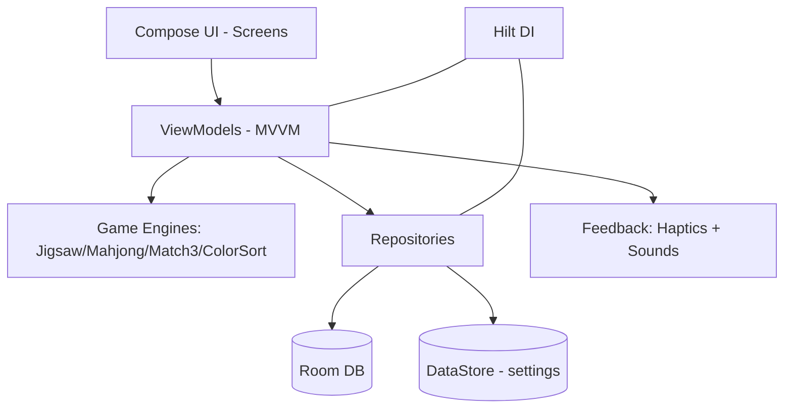

<div align="center">


# 🧩 Fatima Games

**Jogos casuais para Android, com calma, beleza e acessibilidade em primeiro lugar.**
*Calm, beautiful, accessibility-first casual games for Android.*

[](https://www.android.com)
[](https://kotlinlang.org)
[](https://developer.android.com/jetpack/compose)
[](https://dagger.dev/hilt/)
[](https://developer.android.com/training/data-storage/room)
[](https://gradle.org)
[](#)

🇧🇷 [**Português**](#-português) · 🇺🇸 [**English**](#-english)

</div>

---

## 🇧🇷 Português

<a name="-português"></a>

### O que é

**Fatima Games** é um aplicativo Android nativo de jogos casuais, escrito 100% em
**Kotlin + Jetpack Compose (Material 3)**. O foco não é viciar — é relaxar: visual coeso,
animações suaves a 60fps, modo escuro, fontes escaláveis e zero monetização agressiva.
Cada jogo tem seu motor escrito do zero (slicer de quebra-cabeça, engine de Mahjong,
cascade de Match-3, solver de Color Sort).

| | |
|---|---|
| **Plataforma** | Android (Kotlin, Jetpack Compose) |
| **Min SDK** | 26 (Android 8.0) · **Target SDK** 34 (Android 14) |
| **Arquitetura** | MVVM + Hilt (DI) + Room + DataStore + Navigation Compose |
| **Versão** | 1.0.0 |
| **Distribuição** | APK direto → Google Play Store (futuro) |
| **Como compilar** | [BUILD.md](BUILD.md) · [HOW_TO_GET_APK.md](HOW_TO_GET_APK.md) |

### Recursos

**Polimento de experiência**
- Saudação dinâmica (Bom dia / tarde / noite) na Home + Continue Banner de partida salva
- Ilustrações vetoriais customizadas em cada card de jogo
- Tema **claro / escuro / automático** aplicado em runtime
- **Escala de fonte** global (Normal / Grande / Maior)
- **Háptica integrada** com toggle (tick, snap, erro, vitória) + efeitos sonoros
- **Tela de vitória** com confete + medalha + cards de estatísticas
- Tutorial overlay, estado vazio reutilizável e diálogo de confirmação de saída

**Jogos**
- **Jigsaw (Quebra-cabeça)** — slicer com cubic Bézier (tab/slot clássico), drag-and-drop
  com snap entre vizinhas, agrupamento union-find, fotos próprias
- **Mahjong** — layout tartaruga, `isFree()` correto, match com equivalência
  Flores/Estações, Dica/Desfazer/Embaralhar, **auto-save funcional**
- **Match-3** — grid 8×8, swap, cascade com gravidade, **gemas especiais** (Flame H/V,
  Bomb) em matches 4+/5+, pontuação por fase
- **Color Sort** — **30 fases procedurais com solver reverso** (sempre solucionáveis),
  undo, tubo extra
- **Frogger** e **Campo Minado (Minesweeper)** — motores adicionais presentes no código
  (ver `feature/games/frogger` e `feature/games/minesweeper`)

**Persistência & Stats**
- **Room** (records, game state, fotos, settings) + **DataStore** (configs + flags de
  tutoriais vistos)
- **Stats** com mini gráfico de barras das últimas 10 partidas por jogo

**Acessibilidade**
- Touch targets 44dp+ (56–72dp nos botões principais), textos ≥ 16sp configuráveis até
  1.30×, modo escuro 100% funcional, contraste AA mínimo

### Como rodar

```bash
# Via Android Studio: File → Open → esta pasta → Run (▶)

# Via terminal (precisa de JDK 17 + Android SDK):
./gradlew assembleDebug
# APK gerado em: app/build/outputs/apk/debug/app-debug.apk
```

> Guia completo passo a passo (incluindo geração e instalação do APK) em
> [BUILD.md](BUILD.md) e [HOW_TO_GET_APK.md](HOW_TO_GET_APK.md).

### Estrutura

```
FatimaGames/
├── README.md · BUILD.md · HOW_TO_GET_APK.md
├── settings.gradle.kts · build.gradle.kts · gradle.properties
├── gradle/ (libs.versions.toml, wrapper) · gradlew · gradlew.bat
├── docs/                              # PRD, design system, arquitetura, specs, roadmap
└── app/src/main/
    ├── AndroidManifest.xml
    ├── java/com/fatimagames/app/
    │   ├── core/      # di · feedback (haptics/sounds) · navigation · theme · ui
    │   ├── data/      # db (Room) · repository · settings (DataStore)
    │   ├── domain/    # model · repository
    │   └── feature/games/   # jigsaw · mahjong · match3 · colorsort · frogger · minesweeper
    └── res/                  # strings, colors, themes, drawables, icons
```

### Arquitetura



### Documentação

- [PRD](docs/01-product/PRD.md) · [Personas](docs/01-product/personas.md)
- [Design System](docs/02-design/design-system.md) · [UX & a11y](docs/02-design/ux-principles.md)
- [Arquitetura](docs/03-architecture/architecture.md)
- Specs: [Jigsaw](docs/04-games/jigsaw.md) · [Mahjong](docs/04-games/mahjong.md) · [Match-3](docs/04-games/match3.md) · [Color Sort](docs/04-games/color-sort.md)
- [Padrões + ADRs](docs/05-engineering/standards.md) · [Roadmap](docs/06-roadmap.md)

### Princípios não-negociáveis

1. Zero monetização agressiva — sem anúncios, sem IAP
2. Acessibilidade-first — touch targets generosos, contraste alto, fontes legíveis
3. Trabalho nunca se perde — auto-save em jogos longos
4. Visual coeso — uma paleta, um sistema de motion
5. Performance > efeito — 60fps no device-alvo é regra

---

## 🇺🇸 English

<a name="-english"></a>

### What it is

**Fatima Games** is a native Android casual-games app, written entirely in
**Kotlin + Jetpack Compose (Material 3)**. The goal isn't to hook you — it's to relax:
a cohesive look, smooth 60fps animations, dark mode, scalable fonts and zero aggressive
monetization. Every game ships its own hand-written engine (jigsaw slicer, Mahjong engine,
Match-3 cascade, Color Sort solver).

| | |
|---|---|
| **Platform** | Android (Kotlin, Jetpack Compose) |
| **Min SDK** | 26 (Android 8.0) · **Target SDK** 34 (Android 14) |
| **Architecture** | MVVM + Hilt + Room + DataStore + Navigation Compose |
| **Version** | 1.0.0 |
| **How to build** | [BUILD.md](BUILD.md) · [HOW_TO_GET_APK.md](HOW_TO_GET_APK.md) |

### Features

- **Polish** — dynamic greeting + continue banner, custom vector art per game,
  light/dark/auto theme at runtime, global font scaling, integrated haptics + sound,
  victory screen (confetti + medal + stats), tutorial overlays and reusable dialogs.
- **Games** — Jigsaw (cubic-Bézier slicer, drag-and-drop snap, union-find grouping),
  Mahjong (turtle layout, working auto-save, hint/undo/shuffle), Match-3 (8×8 grid,
  gravity cascade, special gems), Color Sort (30 reverse-solver levels, always solvable),
  plus Frogger and Minesweeper engines present in the codebase.
- **Persistence** — Room (records, game state, photos, settings) + DataStore (config +
  seen-tutorial flags), with per-game bar-chart stats of the last 10 plays.
- **Accessibility** — 44dp+ touch targets, ≥16sp text scalable to 1.30×, full dark mode,
  AA-minimum contrast.

### Getting started

```bash
# Android Studio: File → Open → this folder → Run (▶)

# Terminal (needs JDK 17 + Android SDK):
./gradlew assembleDebug
# APK at: app/build/outputs/apk/debug/app-debug.apk
```

Full step-by-step in [BUILD.md](BUILD.md) and [HOW_TO_GET_APK.md](HOW_TO_GET_APK.md).
The architecture diagram and structure are in the Portuguese section above.

---

<div align="center">

*Parte do ecossistema de projetos de **Caio**.*

</div>
